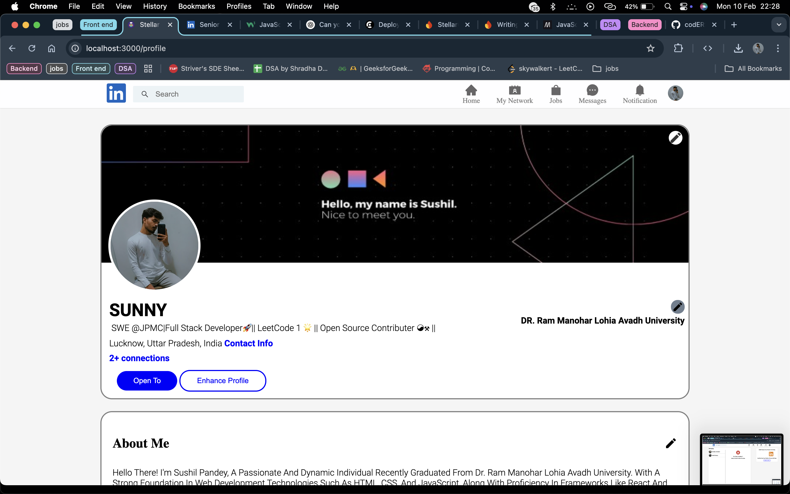

# Stellar connect

Stellar connect is a feature-rich social networking platform designed to connect professionals and facilitate networking opportunities. With its intuitive interface and robust features, users can effortlessly engage with their professional community

# 📦 Tech Stack

- ReactJS: Frontend library for building user interfaces.
- Ant Design: UI framework for enhancing the visual appeal and user experience.
- Firebase: Backend as a service providing authentication and database.
- CSS: Styling language for the user interface.
- Clerk: Authentication solution for managing user sessions and sign-ups.

# 👨🏼‍🍳 Features

Stellar connect offers a comprehensive suite of features to enhance user interaction and connectivity:

- User Authentication: Secure sign-up and login process with email verification.
- Email Verification: Users need to verify their email before accessing the main functionalities.
- Home Section: Users can see posts from other users, upload their own posts, and like posts.
- MyNetwork Section: Users can view all users from the database and add connections.
- Messages, Jobs, and Notifications: Dedicated sections for messaging, job postings, and notifications.
- Lazy Loading: Implemented to optimize performance and improve user experience.

# ⛏️ Process

## Planning and Setup

- Requirement Gathering: Outlined the project's requirements, features, and technologies to be used.
- Initial Setup: Set up the project structure and installed necessary dependencies.
- Backend Development
- Firebase Integration: Configured Firebase for authentication and data storage.
- Clerk Setup: Integrated Clerk for user authentication and session management.
- Frontend Development
- UI Design: Designed the user interface using ReactJS and Ant Design.
- State Management: Managed application state using zustand.
- Feature Implementation: Implemented features such as post uploads, liking posts, and adding connections.

## Testing and Debugging

- Unit Testing: Conducted unit tests to ensure individual components work correctly.
- Integration Testing: Performed integration tests to verify the interaction between different parts of the application.
- End-to-End Testing: Ensured the application works as expected from the user's perspective.

## Deployment and Optimization

- Optimization: Used lazy loading to improve performance and load times.
- Deployment: Deployed the application to a hosting platform(vercel).

## Monitoring and Maintenance

- Monitoring: Implemented tools to track application performance and user activity.
- Maintenance: Regular updates and bug fixes to enhance user experience and security.

## 📚 Learning

During the development process, valuable insights and skills were gained in various areas:

- Authentication: Implemented secure user authentication and email verification.
- Real-Time Updates: Managed real-time data updates using Firebase.
- State Management: Efficiently managed application state with Zustand.
- Performance Optimization: Enhanced application performance with lazy loading.
- UI/UX Design: Created an intuitive and visually appealing user interface with Ant Design and Reactjs.

# ✨ Improvement

Feel free to provide suggestions or contribute to the project. Your feedback is valuable to us!

## Installation

Clone the repo:

```bash
  git clone https://github.com/yourusername/LinkedInClone.git
```

Install the Dependencies::

```bash
  npm install

```

Start the development Server::

```bash
  npm run dev
```

## Authors

- [@codERSunny](https://github.com/codERSunny812)

## Screenshots


## App UI

**Home of the App:**


**Registration Page of the App:**


**Login Page of the App:**


**Connection page of the App:**


**Profile section of the App:**


**main section of the App:**


